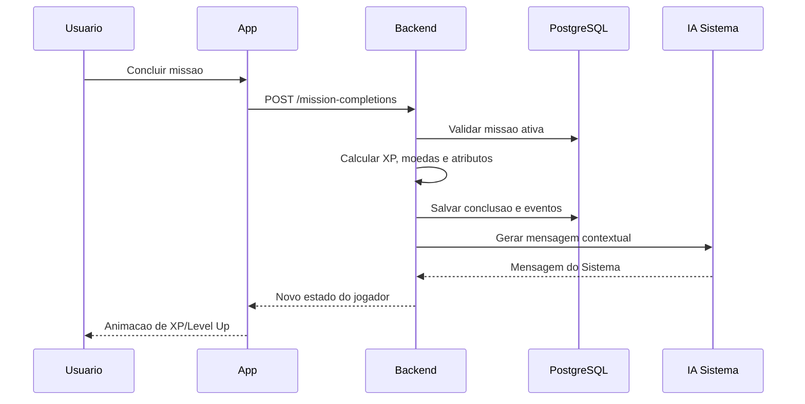

# Ascend - Arquitetura

## Stack recomendada

### Frontend web

- Next.js com App Router.
- TypeScript.
- Tailwind CSS ou CSS Modules com design tokens.
- Framer Motion para animacoes de XP, level up e HUD.
- Zustand ou Redux Toolkit para estado client-side.
- TanStack Query para cache de dados remotos.

### Mobile

- React Native com Expo.
- Push notifications via Expo Notifications ou Firebase Cloud Messaging.
- Widgets futuros para streak e missao do dia.

### Backend

- NestJS ou Fastify com TypeScript.
- API REST para MVP; GraphQL pode entrar quando o social ficar mais complexo.
- Jobs assíncronos com BullMQ.
- Webhooks para pagamentos e notificacoes.

### Banco de dados

- PostgreSQL como banco principal.
- Prisma ORM.
- Redis para cache, filas, rate limit e eventos temporarios.
- Object storage S3-compativel para imagens de perfil, cards e exports.

### IA

- OpenAI Responses API para o assistente "Sistema".
- RAG com historico do usuario, metas, classe, streaks, falhas e preferencias.
- Moderacao e regras de seguranca para evitar conselhos medicos/psicologicos indevidos.
- Prompt com personalidade: firme, curto, cinematografico e orientado a acao.

### Auth

- Clerk, Auth0 ou Supabase Auth para MVP.
- Login social, email/senha e magic link.
- RBAC para usuario, lider de guilda, admin e coach.

### Deploy

- Web: Vercel.
- API: Fly.io, Render, Railway ou AWS ECS.
- DB: Neon, Supabase Postgres ou AWS RDS.
- Redis: Upstash ou Redis Cloud.
- Observabilidade: Sentry, PostHog, OpenTelemetry.

## Dominios

- Identity: usuario, sessao, perfil, preferencias.
- Progression: XP, nivel, rank, atributos, titulos.
- Missions: templates, missoes ativas, conclusoes e recompensas.
- Habits: habitos, check-ins, streaks, penalidades.
- Classes: classe, skills, arvore e buffs.
- Spiritual: devocional, leitura, oracao, testemunhos, discipulado.
- Social: amigos, guildas, rankings, desafios.
- AI System: geracao de missoes, alertas, analises e resumos.
- Billing: planos, assinaturas, limites e entitlements.

## Fluxo de conclusao de missao

## Escalabilidade futura

- Event sourcing leve para eventos de progressao.
- Leaderboards precomputados por janela diaria/semanal/mensal.
- Separar missoes geradas por IA de missoes canonicas.
- Feature flags para testar mecanicas de balanceamento.
- Anti-cheat comportamental: limites diarios, auditoria de missoes repetidas e deteccao de abuso.
