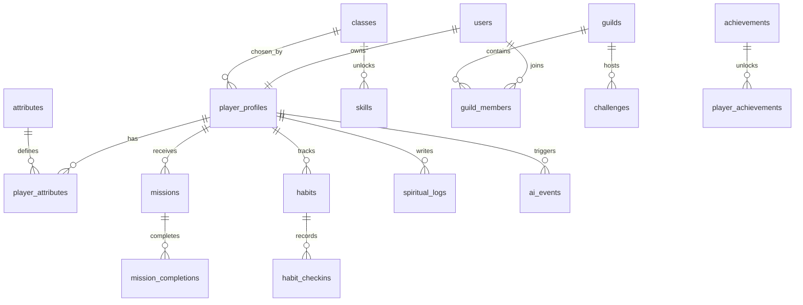

# Ascend - Modelo de Dados

## Entidades principais

### users

- id
- name
- email
- avatar_url
- locale
- timezone
- created_at
- updated_at

### player_profiles

- id
- user_id
- display_name
- class_id
- level
- current_xp
- lifetime_xp
- rank
- coins
- streak_days
- last_active_at

### attributes

- id
- key
- name
- description

### player_attributes

- id
- player_profile_id
- attribute_id
- score
- xp_allocated
- updated_at

### classes

- id
- key
- name
- description
- primary_attribute_id
- secondary_attribute_id

### skills

- id
- class_id
- name
- description
- unlock_level
- effect_type
- effect_value

### mission_templates

- id
- title
- description
- category
- default_difficulty
- attribute_id
- base_xp
- base_coins
- is_ai_seed

### missions

- id
- player_profile_id
- template_id
- title
- category
- difficulty
- attribute_id
- status
- due_at
- generated_by
- created_at

### mission_completions

- id
- mission_id
- player_profile_id
- xp_awarded
- coins_awarded
- attribute_gain
- completed_at
- evidence_url
- reflection

### habits

- id
- player_profile_id
- title
- attribute_id
- frequency
- penalty_policy
- created_at

### habit_checkins

- id
- habit_id
- checked_at
- status
- xp_awarded

### spiritual_logs

- id
- player_profile_id
- type
- title
- content
- duration_minutes
- scripture_reference
- logged_at

### discipleship_links

- id
- mentor_user_id
- disciple_user_id
- status
- started_at

### guilds

- id
- name
- slug
- owner_user_id
- visibility
- created_at

### guild_members

- id
- guild_id
- user_id
- role
- joined_at

### challenges

- id
- guild_id
- title
- category
- start_at
- end_at
- reward_xp
- reward_badge_id

### achievements

- id
- key
- name
- rarity
- description
- unlock_rule

### player_achievements

- id
- player_profile_id
- achievement_id
- unlocked_at

### ai_events

- id
- player_profile_id
- event_type
- prompt_context
- response_text
- created_at

## Relacionamentos

